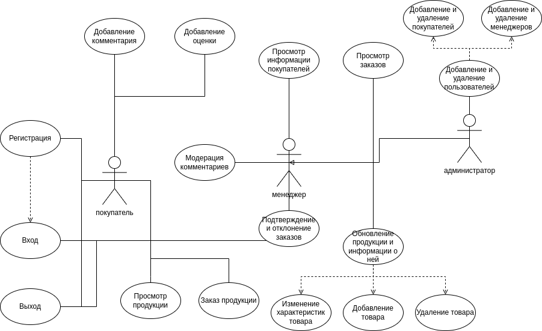
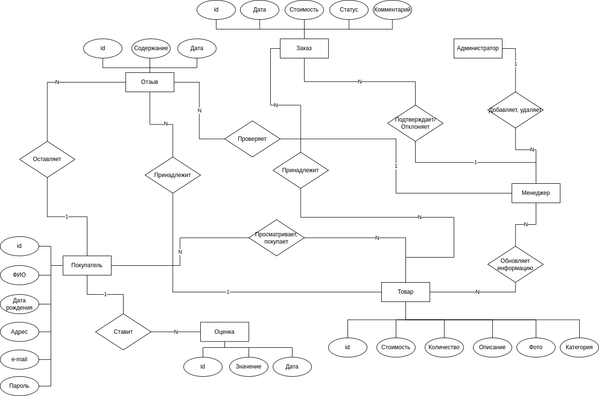
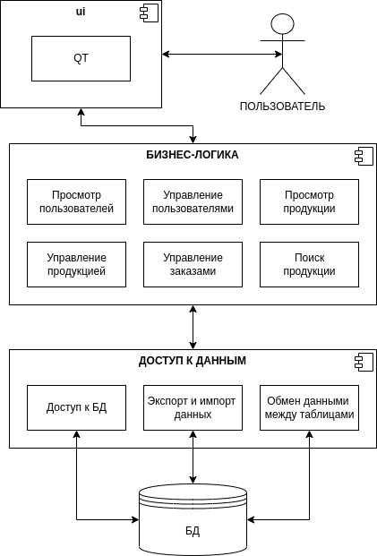
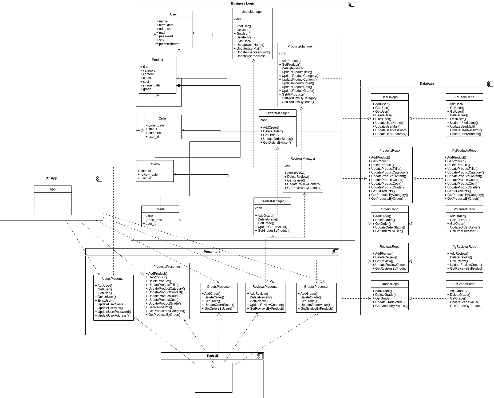
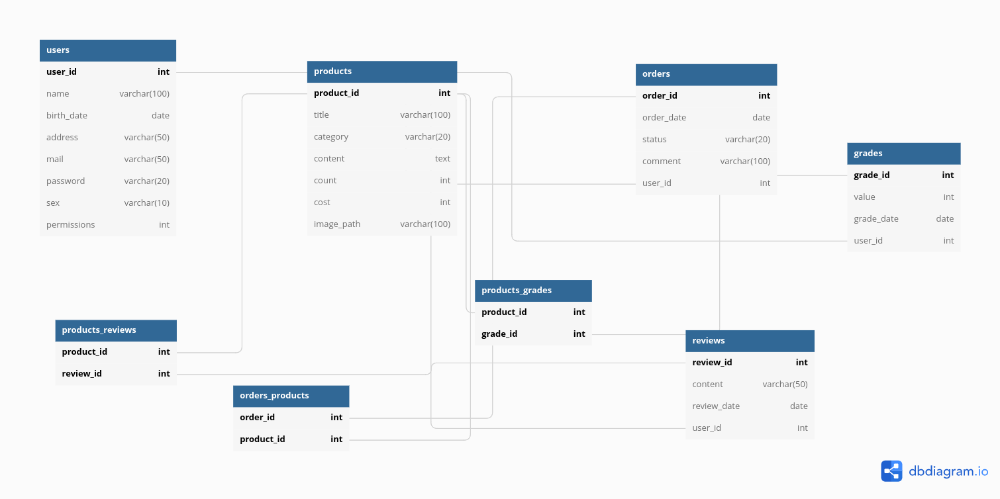

### Use-Case - диаграмма

### ER-диаграмма сущностей

## Лабораторная работа № 2

### Описание типа приложения и выбранного технологического стека
**Тип приложения** - Desktop

**Технологический стек** - C++, Qt, PostgreSQL

### Верхнеуровневое разбиение на компоненты

### UML диаграммы классов для двух отдельных компонентов - компонента доступа к данным и компонента с бизнес-логикой

### Сущности БД

